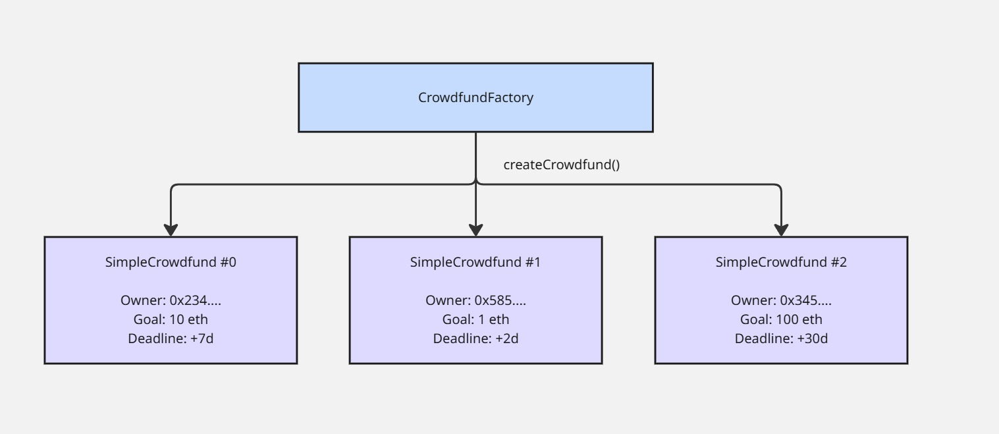

# 🚀 CrowdfundFactory – Create and Manage Multiple Crowdfund Campaigns

## 📌 Description

**CrowdfundFactory** is a minimal smart contract factory that allows anyone to create multiple, independent instances of the SimpleCrowdfund contract. Each campaign created through the factory has its own parameters and logic, while the factory keeps track of all deployments.

This pattern enables DApps, DAOs, and platforms to programmatically spawn new crowdfunding campaigns with one centralized point of creation.

🚀 Unlike traditional platforms that rely on intermediaries, **CrowdfundFactory** runs entirely on-chain — meaning **no platform fees**, **no censorship**, and **guaranteed logic enforcement**. It’s ideal for startups, creators, communities, or developers looking to raise ETH securely and transparently from supporters.

Whether you're launching a new idea or backing one, **CrowdfundFactory** ensures for every campaign that:
- 💸 **Funds are only released if the funding goal is reached**, protecting contributors from failed or abandoned projects.
- 🔁 **Automatic refunds are guaranteed** if the goal isn't met by the deadline — no need to rely on third parties.
- 🔐 **Security is built-in**, using audited OpenZeppelin libraries and protections like reentrancy guards and strict ownership controls.
- ⏳ **Deadlines can be extended once**, providing flexibility while maintaining trust.

This contract gives backers peace of mind and empowers project owners with a trustless fundraising tool that can be easily deployed, customized, and integrated into any DApp or Web3 experience.

Built with **Solidity 0.8.28**, the contract includes basic protections such as **reentrancy guards** and ownership control using OpenZeppelin libraries.

---

## 🧩 Features

| **Feature**                 | **Description**                                                               |
|-----------------------------|-------------------------------------------------------------------------------|
| 🏗️ **Campaign Creation**         | Deploy new `SimpleCrowdfund` instances using a single function call.         |
| 🗂️ **Campaign Registry**         | Keeps a record of all deployed campaigns in a public mapping.                |
| 🔢 **Auto-Indexing**             | Each campaign is stored and accessible by an incremental ID (`uint256`).     |
| 📦 **Constructor Forwarding**    | Automatically forwards constructor arguments: owner, goal, and deadline.     |
| 💰 **ETH Contributions**     | Users can contribute ETH towards the crowdfunding goal.                      |
| ⏰ **Deadline Control**       | Contributions only accepted before the deadline.                             |
| 🧭 **Deadline Extension**     | Owner can extend the deadline one time, only before it ends.  
| 🎯 **Funding Goal**           | The contract tracks whether the funding goal has been reached.               |
| 💸 **Owner Withdrawal**       | Owner can withdraw funds only if the goal is met after the deadline or early.|
| 🔄 **Contributor Refunds**    | Contributors can refund their ETH if goal is not met by the deadline.        |
| 🛡️ **ReentrancyGuard**       | Protection against reentrancy attacks on withdrawals and refunds.            |
| 🔑 **Ownable**                | Ownership control for withdrawal functionality.                              |

---

## ⚙️ How It Works

The `CrowdfundFactory` acts as a generator of independent `SimpleCrowdfund` campaigns. Each time `createCrowdfund(...)` is called, a new crowdfunding contract is deployed with its own parameters (owner, goal, deadline).

All campaigns are mapped and indexed inside the factory using a counter (`crowdfundCount`) so they can be retrieved or displayed later.

This allows platforms and DApps to launch **unlimited campaigns**, each running independently with no overlap in funds or logic.

---

### 🧭 System Diagram



🗂 All campaigns are stored in: crowdfunds[uint256 id]

---

## 📜 CrowdfundFactory Contract Details

### 📊 Factory State

| **Variable**       | **Type**    | **Description**                                     |
|--------------------|-------------|-----------------------------------------------------|
| `crowdfunds` | `mapping(uint256 => Crowdfund)` | Maps each index to its corresponding campaign data.|
| `crowdfundCount` | `uint256` | Total number of campaigns created via the factory.|


### 🔧 Functions

| **Function**       | **Description**                                                                 |
|--------------------|---------------------------------------------------------------------------------|
| `createCrowdfund()` | Allows to create a new crowdfund campaign.                  |

---

### 📡 Events

| **Event**      | **Description**                                        |
|----------------|--------------------------------------------------------|
| `CrowdfundCreated`  | Emitted when a new campaign is created.     |

---

## 📜 SimpleCrowdfund Contract Details

### ⚙️ Constructor

```solidity
constructor(address _owner, uint256 _goal, uint256 _deadline)
```

Initializes the crowdfunding contract with the owner address, funding goal (in wei), and campaign deadline (Unix timestamp).

---

### 🔧 Functions

| **Function**       | **Description**                                                                 |
|--------------------|---------------------------------------------------------------------------------|
| `contribute()`     | Allows users to send ETH as contributions before the deadline.                  |
| `withdraw()`       | Allows the owner to withdraw funds if the goal is met and deadline passed.      |
| `refund()`         | Allows contributors to refund their ETH if the funding goal is not met.         |
| `extendDeadline()	`| Allows the owner to extend the deadline once, before it expires.                |
| `isGoalMet()`      | Returns whether the funding goal has been reached.                             |

---

### 📡 Events

| **Event**      | **Description**                                        |
|----------------|--------------------------------------------------------|
| `Contributed`  | Emitted when a user successfully contributes ETH.     |
| `Withdrawn`    | Emitted when the owner withdraws funds.                |
| `Refunded`     | Emitted when a contributor successfully refunds ETH.  |
| `DeadlineExtended`| Emitted when the deadline is extended by the owner.|

---

### 🔐 Validations & Security

- ❌ Contributions are **rejected** after the deadline.
- ❌ Zero-value contributions are not allowed.
- ✅ Only the **owner** can withdraw funds.
- ❌ Refunds are not allowed if the funding goal is reached.
- ✅ Uses **ReentrancyGuard** to protect against reentrancy attacks.
- ✅ Prevents refunding more than the original contribution.
- ❌ Deadline can only be extended once, and only before it ends.

---

## 🧪 Testing with Foundry

The contract is thoroughly tested using **Foundry**, with complete coverage across all major functionalities.

Two helper contracts are used to simulate edge cases and failure scenarios:

- **`RejectEther`**: Simulates a contract that **refuses to accept ETH**, used to test how the crowdfund contract handles failed withdrawals to the owner.
- **`RejectRefund`**: Simulates a contributor that **rejects refunds**, ensuring the refund logic handles recipient-side failures safely.

### 🧪 Test Cases CrowdfundFactory

| Test Function                            | Purpose                                                                 |
|------------------------------------------|-------------------------------------------------------------------------|
| `testInitialCrowdfundCountIsZero`       | Verifies that the initial crowdfunds count is zero.|
| `testCreateCrowdfundIncrementsCount`    | Ensures the the counter increases when a new crowdfund is created |
| `testCreateCrowdfundStoresCorrectData`  | Confirms that the crowdfund campaign stores the correct data |

### 🧪 Test Cases SimpleCrowdfund

| Test Function                            | Purpose                                                                 |
|------------------------------------------|-------------------------------------------------------------------------|
| `testWrongConstruction`                  | Ensures constructor fails with invalid inputs (zero goal, past deadline). |
| `testInitialValues`                      | Confirms correct setup of owner, goal, deadline, etc.                   |
| `testContributeCorrectly`                | Tests ETH contribution functionality.                                  |
| `testMultipleContributions`              | Verifies correct accumulation per contributor.                         |
| `testCannotContributeAfterDeadline`      | Ensures no contributions are accepted after deadline.                  |
| `testCannotContributeWithZeroAmount`     | Rejects contributions of 0 ETH.                                        |
| `testWithdrawCorrectly`                  | Owner can withdraw funds if goal is met after deadline.                |
| `testCannotWithdrawBeforeDeadline`       | Prevents withdrawal before deadline.                                   |
| `testCannotWithdrawIfGoalNotMet`         | Prevents withdrawal if goal not reached.                               |
| `testCannotWithdrawNotOwner`             | Only owner can call `withdraw()`.                                      |
| `testConsultIfGoalIsMet`                 | Checks positive result for `isGoalMet()` when goal is reached.         |
| `testConsultIfGoalIsNotMet`              | Checks negative result for `isGoalMet()` if goal not reached.          |
| `testRefundCorrectly`                    | Refund works when goal not met after deadline.                         |
| `testCannotRefundBeforeDeadline`         | Refund fails before deadline.                                          |
| `testCannotRefundGoalMet`                | Refund fails if funding goal is met.                                   |
| `testCannotRefundIfNoContributions`      | Refund fails for users who never contributed.                          |
| `testWithdrawFailsIfOwnerRejectsEther`   | Uses `RejectEther` to test withdrawal failure when owner rejects ETH.  |
| `testRefundFailsIfReceiverRejectsEther`  | Uses `RejectRefund` to test refund failure when contributor rejects ETH.|
| `testExtendDeadline`                     | Verifies the owner can successfully extend the deadline before it ends. |
| `testCannotExtendDeadlineNotLater`       | Ensures extension fails if new deadline is not later than current one. |
| `testCannotExtendDeadlineIfAlreadyPassed`| Prevents deadline extension after the crowdfunding has ended. |
| `testCannotExtendDeadlineIfAlreadyExtended`| Verifies that the deadline can only be extended once. |
| `testCannotExtendDeadlineIfNotOwner`     | Ensures only the owner can extend the deadline. |
| `testFuzzContributeAmount`               | Tests single contributions using random valid ETH amounts.             |
| `testFuzzMultipleContributors`           | Verifies balance tracking for multiple random contributors and amounts.|
| `testFuzzWithdrawAfterGoal`              | Ensures the owner can withdraw funds when a fuzzed amount ≥ goal is reached. |
| `testFuzzRefund`                         | Confirms that refunds work correctly for random amounts < goal after the deadline. |

To run all tests with Foundry:

```bash
forge test
```

### 📊 Coverage Report

| File                    | % Lines         | % Statements     | % Branches      | % Functions     |
|-------------------------|------------------|-------------------|------------------|------------------|
| `src/CrowdfundFactory.sol` | 100.00% (5/5) | 100.00% (5/5) | 100.00% (0/0) | 100.00% (1/1)   |
| `src/SimpleCrowdfund.sol` | 100.00% (34/34) | 100.00% (31/31) | 100.00% (28/28) | 100.00% (6/6)   |


## 🔗 Dependencies

- [OpenZeppelin Contracts](https://github.com/OpenZeppelin/openzeppelin-contracts)
  - `Ownable.sol`
  - `ReentrancyGuard.sol`

---

## 🛠️ How to Use

### 🔧 Prerequisites

- Install [Foundry](https://book.getfoundry.sh/getting-started/installation) or preferred Solidity development environment.
- Wallet with ETH to contribute.
- Deploy the contract with valid owner address, funding goal, and future deadline.


### 🚀 Deployment Example

- Factory:
```solidity
factory = new CrowdfundFactory();
factory.createCrowdfund(ownerAddress, 10 ether, block.timestamp + 7 days);
```

- Individual Campaign:
```solidity
new SimpleCrowdfund(ownerAddress, 10 ether, block.timestamp + 7 days);
```

---

## 📄 License

This project is licensed under the **MIT License**.
